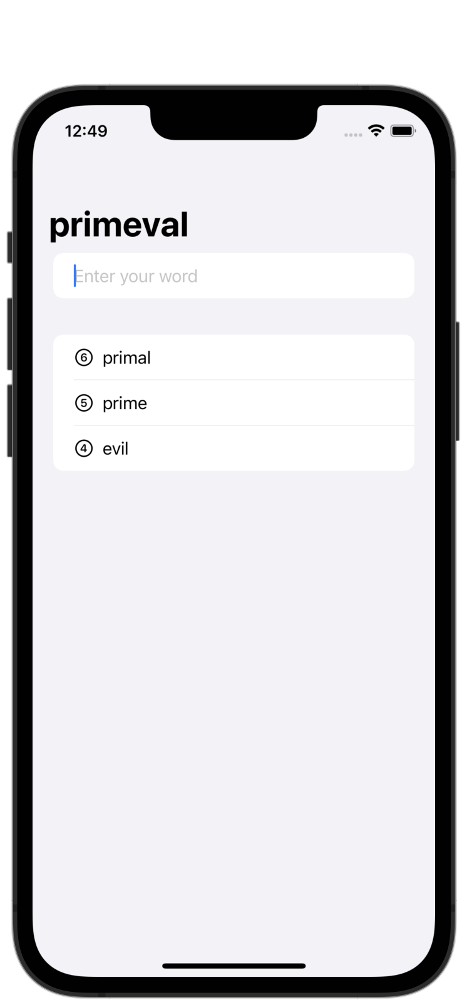

#  Project 5 - WordScramble

[Day 29 - WordScramble Part One](https://www.hackingwithswift.com/100/swiftui/29)

[Day 30 - WordScramble Part Two](https://www.hackingwithswift.com/100/swiftui/30)

[Day 31 - WordScramble Part Three](https://www.hackingwithswift.com/100/swiftui/31)

## Topics

* List
* UITextChecker
* onAppear()
* Bundle
* fatalError()
* More practice with @State, NavigationView

## Challenges

1. Disallow answers that are shorter than three letters or are just our start word.
2. Add a toolbar button that calls startGame(), so users can restart with a new word whenever they want to.
3. Put a text view somewhere so you can track and show the player’s score for a given root word. How you calculate score is down to you, but something involving number of words and their letter count would be reasonable.

## Screenshots

### Base app

    
    

### Challenges

    
    

